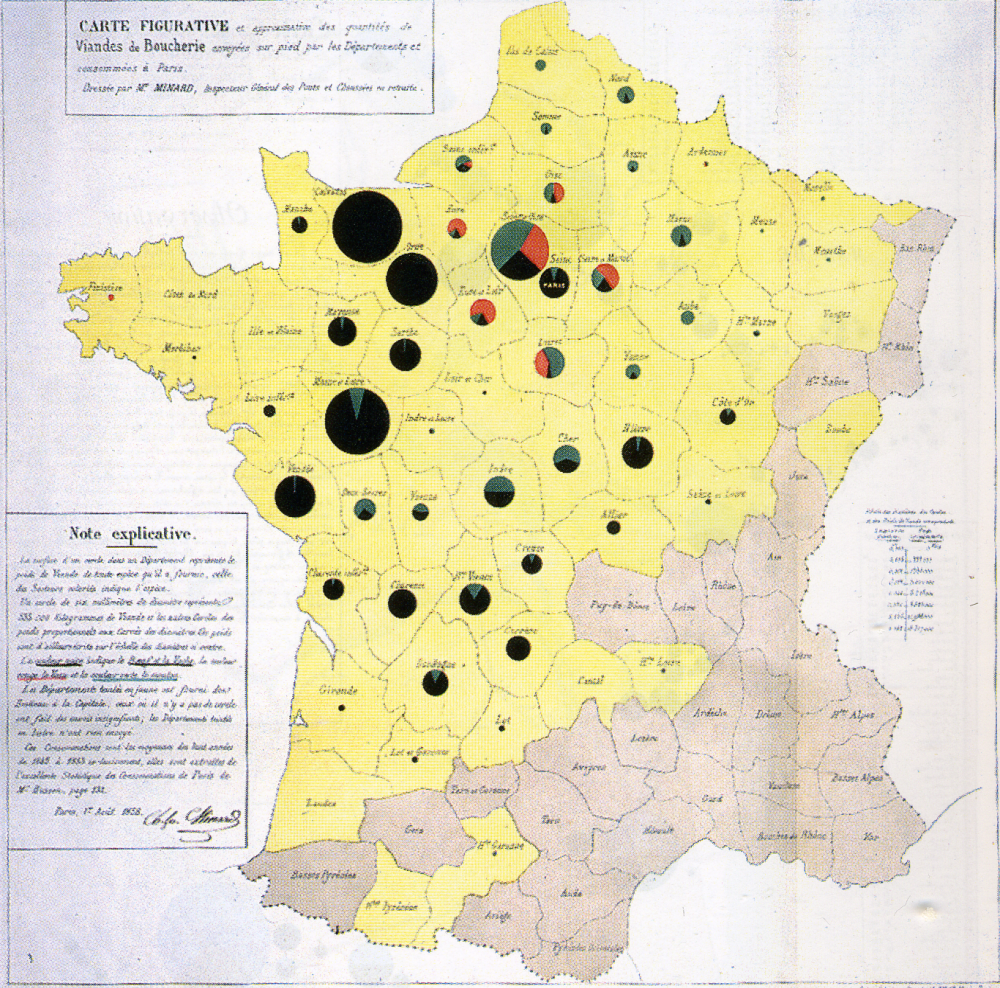

# Úvod

\qquad Vizualizace dat vždy hrála a neustále hraje významnou roli ve vědě. Je to jednoduchý a jeden z nejlepších způsobů pochopení dat. Poskytuje jasnou představu o konfiguraci dat, odhaluje skryte struktury v datech a shrnuje informace. Proces vizualizaci je nedílnou součásti mnoha lékařských analýz a téměř všechny přírodní vědy využívají grafického zobrazení dat k vizualizaci a komunikaci svých výsledků. Dlouhou tradici prezentace dat se vyznačuje i ekonomika. Sbírané a analyzované po dobu mnoha let data se v současné době převádějí do grafické formy. Masivní příliv dat a jejich dostupnost vedli k novým metodám a novým přístupům. Kombinace programovacích dovedností, matematických a statistických znalostí a odborných znalostí týkajících se obsahu přijala název "*Data Science*". Objevily se pozice takzvaných "*information designers*", které vyvíjí vlastní softwary pro vizualizaci dat, zakládají poradenské firmy, pořádají globální workshopy nebo vytvářejí blogy s tisíci registrovanými uživateli. [@datavis_rahlf]  Přes všechny výhody vizualizace, jedná se pouze o nástroj datové analýzy, obecně dostupný každému. Nesprávné či nevhodné použití tohoto nástrojů vede k tomu, že existují grafy, které se považují za moc barevné a rušivý, postrádající smysl až zavádějící. Z tohoto důvodů se obracíme na takzvané zásady vizualizace. (?) 

\qquad $\dots$ popsat zásady vizualizace, její zařazení do datové analýzy,  moderní způsoby vizualizace (používané baličky v R, interaktivní grafy). Aplikace.

\newpage

# Teoretická část {-}

## 1 Grammar of graphics

\newpage
### 1.1 Historie vizualizace dat

\qquad Před 17. stoletím jediné co by se dalo klasifikovat jako vizualizaci dat byly mapy pro navigaci a průzkumu, ale také diagramy, geometrické schémata a tabulky pozic hvězd a jiných nebeských těles. Postupný vývoj statistické teorie a růst zájmu o data na konci 18. století vedly k inovacím a expanzi nových grafických forem. Kartografové se pokoušeli zaznamenat vice, než pouhou geografickou polohu na mapě a objevili se první pokusy o tematické mapování geologických, ekonomických a medicínských dat.

\qquad Wiliam Playfair (1759-1823) je obecně znám jako průkopník v oblasti vizualizace dat a je považován za vynalezce několik typů grafů. Například liniový a sloupcový grafy a graf časových řád byly popsány v jeho práci z roku 1786 \textit{"Commercial and Political Atlas"}^[\textit{"Commercial and Political Atlas: Representing, by Copper-Plate Charts, the Progress of the Commerce, Revenues, Expenditure, and Debts of England, during the Whole of the Eighteenth Century"}]. Později popsal i koláčový graf ve své práci \textit{"Statistical Breviary"} v roce 1801. Obrázek \ref{fig0} ukazuje příklad jeho kreativní kombinace různých vizuálních technik (kruhy, koláče, linie), pomocí které se snažil co nejlépe porovnat daňovou zátěž mezi Británii a dalšími zeměmi. Na tomto grafu také ukázal možnost použíti více měřítek pro různé ukazatele (v grafu populace a daně).

```{r playfair, fig.align='center', fig.cap="\\label{fig0} Kombinace různých vuzuálních techník, Playfair 1801", out.width= '100%', fig.pos='H', echo=FALSE}
knitr::include_graphics("fig/Playfair_taxes_population.jpg")
```
\newpage
```{r minard_3, fig.align='center', fig.cap="\\label{fig01} Postup Napoleonských vojsk v letech 1812-13, Minard 1869", out.height='25%', fig.pos='H', echo=FALSE}
knitr::include_graphics("fig/Minard_1869.png")
```

\begin{minipage}{0.525\textwidth}
\qquad V polovině 19. století byly vytvořeny všechny podmínky pro rychlý růst vizualizace. V důsledku rostoucí významnosti číselné informací pro sociální plánovaní, industrializaci, obchod a dopravu, byli zřízeny oficiální statní úřady po celé Evropě. Vývoj statistické teorie, iniciovaný Gaussem a Laplacem, měl odezvu ve společností a vedl k uvědomení smysluplností velkého množství dat. Pro vizualizaci dat období 1850-1900 se stalo "Zlatý věkem", s jedinečnou krásou a velkým množstvím inovací. S těmito inovacemi je spojené jméno Charlese Josepha Minarda (1781-1870). Například, Minardem bylo vyvinuto použíti koláčových grafů s výsečemi na mapách (obrázek \ref{fig02}), kde velikost koláčového grafu ukazuje sumu za oblast (každý grafický region na mapě) a výsečí reprezentují dílčí součty za jednotlivé kategorie. Dále se zabýval znázorněním geografických pohybu a dopravy lidi, zboží, importu a exportu úměrně jejich velikostí (viz obrázek \ref{fig03}). Jednou z nejslavnějších jeho práci je zobrazení postupných ztrát mužů francouzské armády v ruské kampani v letech 1812-1813 (obrázek \ref{fig01}). Je považovaná za nejlepší informativní vizualizací. V tomto grafu je celkem 6 proměnných (množství, lokace ve dvou rozměrech, postup armády, teplota, datum a skupiny) a jsou znázorněné tak, aniž by graf byl přeplněný a zmatečný.
\end{minipage}
\begin{minipage}{0.025\textwidth}
```{r blank#1, fig.align='center', fig.pos='H', echo=FALSE}
knitr::include_graphics("fig/blank_v.png")
```
\end{minipage}
\begin{minipage}{0.45\textwidth}
\vspace*{-0.8cm}
```{r minard_1, fig.align='center', fig.cap="\\label{fig02} Dobytek odeslaný z celé Francie ke spotřebě v Paříži, Minard 1858", out.width= '99%', fig.pos='H', echo=FALSE}

```
\vspace*{-0.7cm}
```{r minard_2, fig.align='center', fig.cap="\\label{fig03} Mapa světové migrace, Minard 1858", out.width= '99%', fig.pos='H', echo=FALSE}
knitr::include_graphics("fig/minard_flow_map.jpg")
```
\end{minipage}
\newpage

\qquad Začátek 20. století je občas nazýván "moderním temným věkem" vizualizace. V letech 1900-1950 bylo jen málo grafických inovací. Nadšení pro vizualizací, které charakterizovalo 19. století bylo nahrazeno formálními (z velké části statistickými) grafy a modely z oblasti sociologie. Byl zájem o přesné čísla, odhady parametrů, směrodatné odchylky, vizualizace byla představená ve formě fotografii či hezkých a evokujících grafů, nenesoucích přesné fakta. [@dataviz_history] Ve své práci \textit{"Graphic Methods for Presenting Facts"} z roku 1919 Willord C. Brinton [1880-1957] kritizoval a vysvětloval chyby takovýchto grafů. Například koláčový graf rozdělení rodinných příjmů (od 900\$ do 1000\$) na obrázku \ref{fig04}. Tento graf je příkladem nepovedené vizualizace: oko preferenčně soudí dle velikostí obrázků než dle uhlů výsečí. Obrázek hned vedle znázorňuje druhy utracení: je to zábavný způsob vizualizace, avšak nelze přesně určit velikost brašen, ani je porovnat mezi sebou. Další obrázek by měl čtenáři sdělit informaci, že prodej praček za poslední tří roky vzrostl sedmkrát. Z obrázku není patrný poměr sedmi ku jedné ani přesné roky kdy bylo provedeno porovnání údajů. Dále Brinton ve své práci upozorňoval, že neúspěšná prezentace dat může vést k chybným závěrům a také zmiňoval potřebu jakéhosi standardu, souhrnu "gramatických pravidel pro grafický jazyk". [@brinton_1919]

```{r brinton, fig.align='center', fig.cap="\\label{fig04} Ukázky vizualizaci ze začatku 20. století, Brinton 1919", out.width= '100%', fig.pos='H', echo=FALSE}
knitr::include_graphics("fig/brinton.png")
```

\qquad Ke "znovuzrození" vizualizace došlo v polovině šedesatých let 20. století, po napsaní Johnem W. Tukey [1915-2000] článku \textit{"The Future of Data Analysis"}, ve kterém vyzval společnost k uznání analýzy údajů jako samostatného oboru statistiky odlíšného od matematické statistiky. Brzy po tom přišel Tukey s širokou nabídkou nových a efektivních grafů pod společným znamením "Průzkumové analýzy dat". Mezi nimi číslicový histogram (popsaný v kapitole [2.4.3](#stem-and-leaf)), boxplot nebo krabicový graf (popsaný v kapitole [2.3.2](#boxplot)) a další, mnoho z níchž jsou aktivně používané ve statistice a implementované do většiny softwarů. [@dataviz_history]

### 1.2 Zásady vizualizace dat

\qquad $\dots$ **Wiliam S. Cleveland** (*The Elements of Graphing Data* a *Visualizing Data*)

\qquad Kromě práci Wiliama S. Clevelanda se za revoluční průlom považují kniha **Edwarda Tufte** *The Visual Display of Quantitative Information* z roku 1983. V kombinaci s dvěma následně publikovanými pracemi *Envisioning Information* a *Visual Explanations* se říká že Tufte našel autentický způsob k definování standardu tématu. [@datavis_rahlf]

