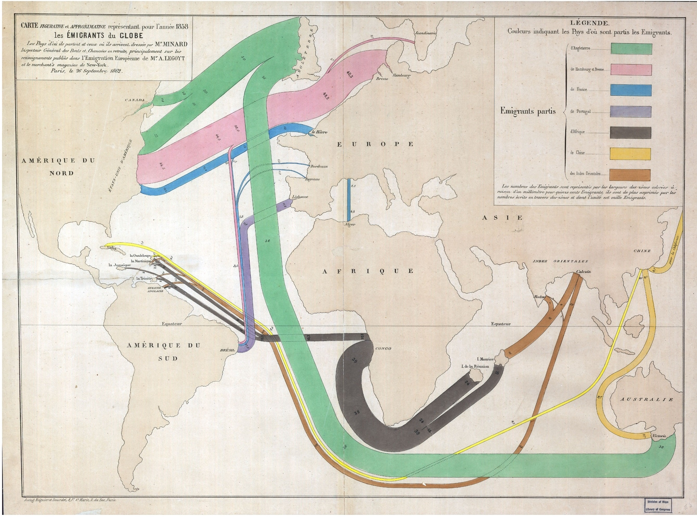
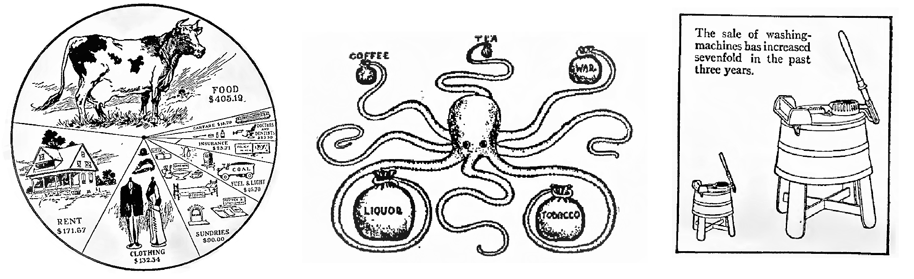

# Úvod

\qquad Vizualizace dat vždy hrála a neustále hraje významnou roli ve vědě. Je to jednoduchý a jeden z nejlepších způsobů pochopení dat. Poskytuje jasnou představu o konfiguraci dat, odhaluje skryte struktury v datech a shrnuje informace. Proces vizualizaci je nedílnou součásti mnoha lékařských analýz a téměř všechny přírodní vědy využívají grafického zobrazení dat k vizualizaci a komunikaci svých výsledků. Dlouhou tradici prezentace dat se vyznačuje i ekonomika. Sbírané a analyzované po dobu mnoha let data se v současné době převádějí do grafické formy. Masivní příliv dat a jejich dostupnost vedli k novým metodám a novým přístupům. Kombinace programovacích dovedností, matematických a statistických znalostí a odborných znalostí týkajících se obsahu přijala název "*Data Science*". Objevily se pozice takzvaných "*information designers*", které vyvíjí vlastní softwary pro vizualizaci dat, zakládají poradenské firmy, pořádají globální workshopy nebo vytvářejí blogy s tisíci registrovanými uživateli. [@datavis_rahlf]  Přes všechny výhody vizualizace, jedná se pouze o nástroj datové analýzy, obecně dostupný každému. Nesprávné či nevhodné použití tohoto nástrojů vede k tomu, že existují grafy, které se považují za moc barevné a rušivý, postrádající smysl až zavádějící. Z tohoto důvodů se obracíme na takzvané zásady vizualizace. (?) 

\qquad $\dots$ popsat zásady vizualizace, její zařazení do datové analýzy,  moderní způsoby vizualizace (používané baličky v R, interaktivní grafy). Aplikace.

\newpage

# Teoretická část {-}

## 1 Vizualizace dat

### 1.1 Historie vizualizace dat

\qquad Před 17. stoletím jediné co by se dalo klasifikovat jako vizualizaci dat byly mapy pro navigaci a průzkum, ale také diagramy, geometrická schémata a tabulky pozic hvězd a jiných nebeských těles. Postupný vývoj statistické teorie a růst zájmu o data na konci 18. století vedly k inovacím a expanzi nových grafických forem. Kartografové se pokoušeli zaznamenat vice, než pouhou geografickou polohu na mapě a objevili se první pokusy o tematické mapování geologických, ekonomických a medicínských dat.

\qquad Wiliam Playfair (1759-1823) je obecně znám jako průkopník v oblasti vizualizace dat a je považován za vynálezce několika typů grafů. Například liniový a sloupcový grafy a grafy časových řád byly popsány v jeho práci z roku 1786 \textit{"Commercial and Political Atlas"}^[\textit{"Commercial and Political Atlas: Representing, by Copper-Plate Charts, the Progress of the Commerce, Revenues, Expenditure, and Debts of England, during the Whole of the Eighteenth Century"}]. Později popsal i koláčový graf ve své práci \textit{"Statistical Breviary"} v roce 1801. Obrázek \ref{fig0} ukazuje příklad jeho kreativní kombinace různých vizualizačních technik (kruhy, koláče, linie), pomocí které se snažil porovnat daňovou zátěž mezi Británii a dalšími zeměmi. Na tomto grafu také ukázal možnost použíti více měřítek pro různé ukazatele (v grafu populace a daně).

```{r playfair, fig.align='center', fig.cap="\\label{fig0} Kombinace různých vuzuálních techník, Playfair 1801", out.width= '100%', fig.pos='H', echo=FALSE}
knitr::include_graphics("fig/Playfair_taxes_population.jpg")
```
\newpage
\begin{wrapfigure}[17]{R}{0.45\textwidth}
    \centering
    \includegraphics[width=0.42\textwidth]{fig/Minard_1858}
    \caption{Dobytek odeslaný z celé Francie ke spotřebě v Paříži, Minard 1858}
    \label{fig01}
\end{wrapfigure}

\qquad V polovině 19. století byly vytvořeny všechny podmínky pro rychlý růst vizualizace. V důsledku rostoucí významnosti číselných informací pro sociální plánovaní, industrializaci, obchod a dopravu, byli zřízeny oficiální statistické úřady po celé Evropě. Vývoj statistické teorie, iniciovaný Gaussem a Laplacem, měl odezvu ve společností a poskytl prostředky ke zpracování velkého množství dat. Pro vizualizaci se stalo dat období 1850-1900 "Zlatý věkem", s jedinečnou krásou a velkým množstvím inovací. S těmito inovacemi je hlavně spojené jméno Charlese Josepha Minarda (1781-1870). Například, Minardem bylo zavedeno použití koláčových grafů s výsečemi na mapách (obrázek \ref{fig01}), kde velikost koláčového grafu ukazuje sumu za oblast neboli každý grafický region na mapě a výseče reprezentují dílčí součty za jednotlivé kategorie. Dále se také zabýval znázorněním geografických pohybu a dopravy lidí, zboží, importu a exportu úměrně jejich velikostí. \ Tento \ typ vizualizace \ se nazývá

\begin{wrapfigure}[12]{L}{0.51\textwidth}
    \centering
    \vspace{-10pt}
    \includegraphics[width=0.5\textwidth]{fig/minard_flow_map.jpg}
    \vspace{-10pt}
    \caption{Mapa světové migrace, Minard 1858}
    \label{fig02}
\end{wrapfigure}
\vspace{-7pt}
\textit{"flow maps"}, viz obrázek \ref{fig02}. Jednou z nejslavnějších jeho práci je zobrazení postupných ztrát mužů francouzské armády během Napoleonského tažení na Moskvu v letech 1812-1813 (obrázek \ref{fig03}). Je považovaná za nejlepší informativní vizualizací. I přestože v tomto grafu je celkem 6 proměnných (množství, lokace ve dvou rozměrech, postup armády, teplota, datum a skupiny), podařilo vše zobrazit tak, aniž by graf byl přeplněný a matoucí.

<!-- \begin{minipage}[H]{0.5\textwidth} -->
<!-- ```{r minard, fig.align='center', fig.cap="\\label{fig02} Mapa světové migrace, Minard 1858", out.width= '100%', fig.pos='H', echo=FALSE} -->
<!--  -->
<!-- ``` -->
<!-- \end{minipage} -->
<!-- \begin{minipage}[H]{0.025\textwidth} -->
<!-- ```{r blank0, fig.pos='H', echo=FALSE} -->
<!--  -->
<!-- ``` -->
<!-- \end{minipage} -->
<!-- \begin{minipage}[H]{0.475\textwidth} -->
<!-- Dále se také zabýval znázorněním geografických pohybu a dopravy lidí, zboží, importu a exportu úměrně jejich velikostí. Tento typ vizualizace se nazývá \textit{"flow maps"}, viz obrázek \ref{fig02}.Jednou z nejslavnějších jeho práci je zobrazení postupných ztrát mužů francouzské armády během Napoleonského tažení na Moskvu v letech 1812-1813 (obrázek \ref{fig03}). Je považovaná za nejlepší informativní vizualizací. I přestože v tomto grafu je celkem 6 proměnných (množství, lokace ve dvou rozměrech, postup armády, teplota, datum a skupiny), podařilo vše zobrazit tak, aniž by graf byl přeplněný a matoucí. -->
<!-- \end{minipage} -->
\newpage

\begin{figure}[H]
\centering
\includegraphics[width = \textwidth]{fig/Minard_1869}
\caption{Postup Napoleonských vojsk v letech 1812-13, Minard 1869}
\label{fig03}
\end{figure}

\qquad Začátek 20. století je občas nazýván "moderním temným věkem" vizualizace. V letech 1900-1950 bylo jen málo grafických inovací. Nadšení pro vizualizací, které charakterizovalo 19. století bylo nahrazeno formálními (z velké části statistickými) grafy a modely z oblasti sociologie. Hlavní zájem byl o přesná čísla, odhady parametrů, směrodatné odchylky. Vizualizace byli považované za pouhé hezké obrázky bez schopnosti podat přesná data. [@dataviz_history] Ve své práci \textit{"Graphic Methods for Presenting Facts"} z roku 1919 Willord C. Brinton [1880-1957] kritizoval a vysvětloval chyby takovýchto grafů. Například koláčový graf rozdělení rodinných příjmů (od 900\$ do 1000\$) na obrázku \ref{fig04}. Tento graf je příkladem nepovedené vizualizace: oko preferenčně soudí dle velikostí obrázků a ne dle uhlů výsečí. Obrázek uprostřed znázorňuje druhy utracení: je to zábavný způsob vizualizace, avšak nelze přesně určit velikost brašen, ani je porovnat mezi sebou. Další obrázek by měl čtenáři sdělit informaci, že prodej praček za poslední tří roky vzrostl sedmkrát. Z obrázku není patrný poměr sedmi ku jedné ani přesné roky kdy bylo provedeno porovnání údajů. Dále Brinton ve své práci upozorňoval, že neúspěšná prezentace dat může vést k chybným závěrům a také zmiňoval potřebu jakéhosi standardu, souhrnu "gramatických pravidel pro grafický jazyk". [@brinton_1919]

```{r brinton, fig.align='center', fig.cap="\\label{fig04} Ukázky vizualizaci ze začatku 20. století, Brinton 1919", out.width= '100%', fig.pos='H', echo=FALSE}

```

\qquad Ke "znovuzrození" vizualizace došlo v polovině šedesátých let 20. století, po napsaní Johnem W. Tukey [1915-2000] článku \textit{"The Future of Data Analysis"}, ve kterém vyzývá společnost k uznání analýzy dat jako samostatného oboru statistiky odlišného od matematické statistiky. [@tukey1962] Brzy poté začal Tukey s vývojem široké řady nových a efektivních grafů pod společným tématem "průzkumové analýzy dat" (popsány v jeho práci \textit{"Explanatory Data Analysis"} z roku 1977, viz o tématu kapitola [3](#EDA)). [@tukey1977] Mezi těmito novými grafy jsou například číslicový histogram (popsaný v kapitole [2.4.3](#stem-and-leaf)), boxplot nebo krabicový graf (popsaný v kapitole [2.3.2](#boxplot)) a další. Mnoho z nich je aktivně používáno ve statistické praxi a implementováno do většiny softwarů. [@dataviz_history] 

\qquad Od roku 1975 se vyvíjí statistické vypočetní systémy a s nimi i nové metody analýzy a vizualizace dat. V tomto období vizualizace začala být vnímána jako vlastní odvětví a to především díky Williamu S. Clevelandu a Edwardu Tufte, kteří položili věděcké základy tohoto odvětví. Tufte vyvinul a popularizoval terminologii a zakladní principy grafické integrity. Clveland se zabívál studii grafického vnímání, kognitivních procesů, které lidi používají k pochopení grafů, a rozvijel teorii o spravném provedení vizualizaci. [@cleveland_priceonomics] Důsledek jejich práce se promítá i do současné doby kvalitní, interaktivní a dynamickou vizualizaci. [@dataviz_history]  

### 1.2 Zásady vizualizace dat

#### 1.2.2 Edward Tufte

\qquad Za revoluční průlom se považuje kniha Edwarda Tufte *The Visual Display of Quantitative Information* z roku 1983. V kombinaci s dvěmi následně publikovanými pracemi *Envisioning Information* z roku 1990 a *Visual Explanations* z roku 1997 to jsou nejznamější publikace na téma vizualizace dat a právě v nich Tufte originálním způsobem definuje  "standard" vizualizace. [@datavis_rahlf] Idealní způsob vizualizace dle Tufte je stručný, elegantní a informativní. Příkladem ideálního grafu je pro Tufte graf postupu Napoleonských vojsk v letech 1812-13, vytvořený Minardem (viz obrázek \ref{fig03}). Tufte říká, že grafická elegance se často nachází v jednoduchosti návrhu a komplexnosti dat. [@tufte1990] Tafte vypracoval základní principy vizualizace: 

* **Grafická dokonalost** - grafika by měla:
  + být o datech a o předvedení dat bez jejích zkreslení
  + vyvolávat otázky o datech, ne o metodologii a technikách vizualizace
  + ukazovat velké množství dat v malém prostoru
  + předvadět velké datasety souvisle a logicky promyšleně
  + sloužit rozumnému a jasnému cíli (popisu, průzkumu, $\dots$)
  + být jednotná se statistickým nebo slovním popisem datasetu
* **Grafická integrita** neboli grafická celistvost a jednoznačnost
  + reprezentace čísel, zobrazené v grafu by měli být přímo úměrné číselným veličinam datasetu
  + jasné, detailní a svědomité označení v grafech by mělo potlačit zkreslení, nejasnost a dvojznačnost, popisky jsou důležitá
  + ukazovat variaci dat, nikoliv designu
  + v případě časových řad, představujících peníze, použivat obecně známé jednotky
  + počet rozměrů představených v grafu by neměl přesahovat počet proměnných datasetu
  + reprezentace by neměla zahrnovat neúmyslný kontext

\begin{minipage}[H]{0.475\textwidth}
 \begin{figure}[H]
\centering
    \includegraphics[height = 11cm]{fig/tufte_shrinking_doctor}
    \caption{Zmenšující se rodinný lékař, Los Angeles Times, 1979}
    \label{fig05}
 \end{figure}
\end{minipage}
\begin{minipage}[H]{0.05\textwidth}
 \includegraphics[height = 9cm]{fig/blank_v}
\end{minipage}
\begin{minipage}[H]{0.475\textwidth}
 \begin{figure}[H]
\centering
    \includegraphics[height = 11cm]{fig/data_ink}
    \caption{Vztah skutečné míry volební registrace k předpovídáným hodnotam, přetištěno E. Tufte, 1983}
    \label{fig06}
 \end{figure}
\end{minipage}

Ve spojení s těmito principy byly zavedeny Edwardem Tuftem následující terminy:

* **Lie factor** je definován jako poměr velikosti efektu zobrázeného v grafu oproti velikosti efektu v datech. Pokud se rovná jedničce, považuji se reprezentované hodnoty za přesné. Pokud je faktor větší než 1.05 či menší než 0.95, indikuje se podstatné zkreslení, přesahující míru drobných nepřesnosti vyskytujících se při vykreslovani grafů. Tafte ve své práci úvádí jako jeden z příkladů graf na obrázku \ref{fig05}. Tento graf zobrazující zmenšující se procento lékařů věnujících se výhradně rodinné praxi má *lie factor* odpovídající hodnotě 2.8, tedy skutečný pokles je značně nadhodnocen.
* **Data ink ratio** - poměr, který vyhodnocuje hustotu grafu a obsah informací. Dal by se vyjadřit vzorcem 
$$\textit{Data ink ratio} = \cfrac{\textit{data-ink}}{\textit{celkový inkoust použitý v datech}},$$
kde $\textit{data-ink}$ je nevynechatelné jádro grafu a smazání jakékoliv jeho části znamená ztrátu informaci. 
Tento vztah také odpovídá podílu grafického inkoustu požitého k vykreslení nepodstatných informací. Dálo by se to také vyjadřit vztahem $1 - \textit{podíl grafiky, která může být vymazána bez ztraty informací}$. Tafte doporučuje tento faktor maximalizovat v rozumných mezích, nejlépe se  vyhnout těžkým mřížkovým liniím na pozadí (dokonce i horizontalním referenčním liniím). V příkladu na obrázku \ref{fig06} jsou zobrazene dvě verze stejného grafu. Horní má hodnotu *data ink ratio* kolem 0.7, dolní graf ale neobsahuje informaci o datech, pouze napomocné čáry, proto *data ink ratio* se rovná nule. 
* **Chartjunk** - se vztahuje ke všem vizuálním elementam, které  neslouží ke komunikaci informací zobrazených v grafu nebo odvádějí pozornost od těchto informací. [@tufte1983]

#### 1.2.1 Wiliam S. Cleveland

\qquad Kromě práci Edwarda Tufte velký vliv měli i publikace Wiliama S. Clevelanda. Cleveland se svým kolegou Robertem McGillem publikovali v roce 1984 článek o grafickém vnímání a také prováděl studie na toto téma. Jedená z nejvíc známých je studie, kterou provedli mezi svými studenty, na rozdíl ve vnímání koláčových a sloupcových grafů. Studenti systematicky odhadováli hodnoty sloupcového grafu přesnějí oproti kolačovému grafu. 
Ve svých prácích *Visualizing data* z roku 1993 a *The Elements of Graphing Data* z roku 1994 se zabýval principy visualizace. 
Definuje čtyři hlavní kategorie: Jasnou vizi, jasnou srozumintelnsot, rozsah a obecnou strategii. 

* **Jasná vize**
  + Data by měla mluvit sama za sebe. 
  + Výrazné grafické prvky musí ukazovat data. 
  + Prostor grafu by neměl být přeplněný. 
  + Pokud je to vhodné referenční linie by měly být použity, ale nesmějí zasahovat do dat. 
  + Popisky dat a legendy nesmějí zasahovat do dat a nesmějí znepřehlednovat graf. 
  + Překrývající se symboly musí být visuálně rozpoznatelné. 
  + Vizuální srozumitelnsot musí být zachována i po reprodukci a i při snížení kvality a změnšení.
  
* **Jasná srozumitelnost**
  + Hlavní závěry by měli být obsaženy i v grafické formě. Legendy by měli být srozumitelné a vyčerpávající.
  + Grafy by měli být korektovány.
  + Hlavními cíly vizualizace by měli být jasnost, srozumitelnost, jednoznačnost. 
  
* **Rozshah**
  + Volit rozshah dat tak, aby obsahoval, případně téměr obsahoval, rozsah dat. 
  + Volit takové měřítko, aby data vyplňovala co největší prostor. 
  + Volit vhodné měřítko podkud jsou dva a více grafy porovnávány.
  
* **Obecná strategie**
  + Velké množsví kvantitavitní informace by měla být vměsnáno do relativně smalých oblastí. 
  + Tvorba grafů by měla být iterativní činnost, experimentální proces
  + Užitečné grafy vyžadůjí pečlivou a detilní práci.


### 1.3 Grammar of graphics
