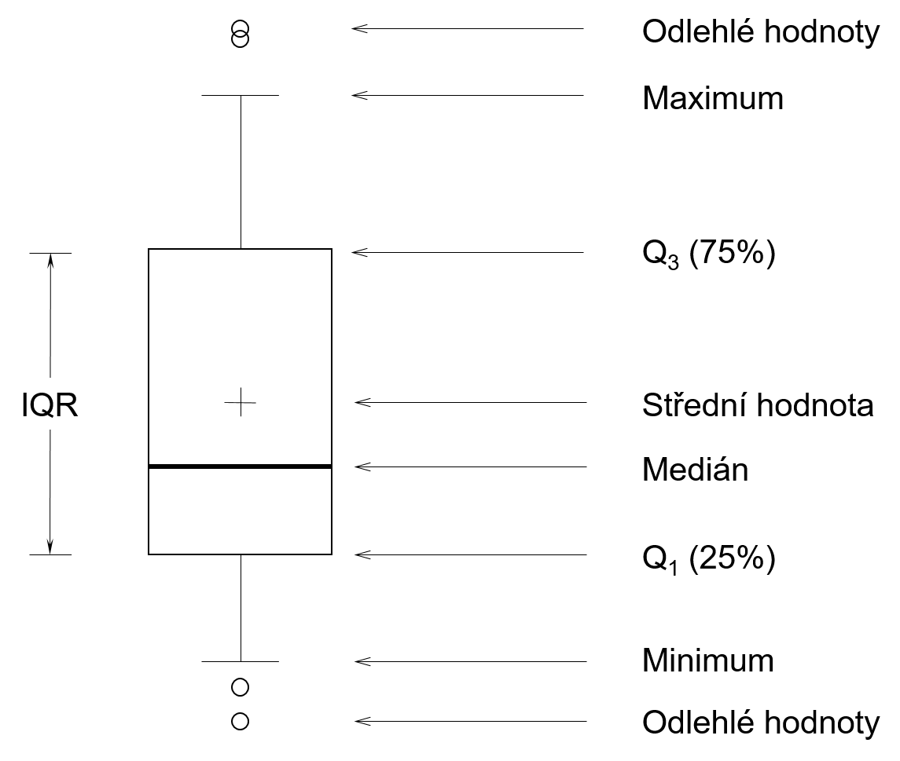

## 2 Základní grafy v R

\qquad Pro vytváření základních grafů v R používáme vestavěný balíček `graphics` [@graphics], který obsahuje mnoho užitečných funkcí pro tvorbu grafických prvků. První kapitola se soustředí na tyto funkce tohoto balíčku a&nbsp;v&nbsp;dalších kapitolách jsou popsány funkce balíčků dalších (například `lattice`, `ggplot2`,...), které zastávají podobné funkce, avšak s různým rozsahem nastavení [@teetor2011].

\qquad V následujících příkladech nejsou grafy doplněny o barvy, popisky os, legendy ani názvy a to především proto, že záměrem této kapitoly je popsat základní grafy a funkce pro jejich tvorbu v prostředí R. Všechny tyto prvky mohou být přidány do grafu, ale tím by  příkazy obsahovali irelevantní parametry vzhledem k zaměření této kapitoly. Základní funkce `plot(x)` jejímž voláním se obdrží pole s grafickou reprezentaci proměnné "x", by při doplnění kódu o veškeré parametry vypadala následovaně [@teetor2011]: 

```{r, eval=FALSE}
plot(x, main = "Název grafu", xlab = "popis osy x", 
+    ylab = "popis osy y", col = c("red", "black", "green")) 
```

Záměrem je tedy používání příkazů s pouze relevantními parametry. 

### 2.1 Bodový graf {#scatterplot}
\qquad Bodový graf je rychlým způsobem, jak znázornit vztahy a souvislosti mezi proměnnými datasetu, případně k zjištění jejich neexistence. Data jsou zobrazeny v&nbsp;kartézském souřadném systému a mají pro každou hodnotu proměnné dané místo na vodorovné a svislé ose. V případě existence závislostí mezi proměnnými lze tuto závislost interpolovat přímkou, křivkou či dalším vhodným vyobrazením této závislosti. 
 
\qquad Pro vytvoření bodového grafu v základním prostředí R (pomocí `graphics`) použijeme funkci `plot()`, která má tento typ grafu předdefinovaný pro numerické hodnoty. Viz obrázek \ref{fig1} (a). Nečíselná data vytvoří jiný typ grafu.

```{r, eval=FALSE}
plot(cars)
```

### 2.2 Liniový graf
\qquad Jediný rozdíl mezi bodovým a liniovým grafem je, že jeden zobrazuje body a&nbsp;druhý je spojuje.[@teetor2011] (viz. obrázek \ref{fig1} (a), (b)). Pro vykreslení liniového grafu se používá již několikrát zmíněná funkce `plot()`, kterou doplníme o požadovaný typ vykreslení:

```{r, eval=FALSE}
plot(x, type="l")
```
V tabulce \ref{tab1} jsou uvedené některé základní atributy parametru `type`, které mohou být použity [@plot]:

\begin{table}[H]
\centering
\begin{tabular}{@{}ccc@{}}
\toprule
  & Anglický popis & Český popis    \\ \midrule
p & points         & bodový         \\
l & lines          & liniový        \\
b & both           & složený        \\
h & histogram      & histogram      \\
n & no plotting    & bez vykreslení \\ \bottomrule
\end{tabular}
\caption{Základní atributy parametru `type`}
\label{tab1}
\end{table}


```{r graf_typy, fig.cap="\\label{fig1} Porovnání základních typů grafů: (a) - bodový, (b) - liniový, (c) - složený, (d) - histogram", fig.height=6, out.width = '80%', echo=FALSE, fig.align='center', fig.pos='H'}
par(mfrow=c(2,2))
plot(pressure, xlab=" ", ylab=" ", sub="(a)")
plot(pressure, type="l",xlab=" ", ylab=" ", sub="(b)")
plot(pressure, type="b",xlab=" ", ylab=" ", sub="(c)")
plot(pressure, type="h",xlab=" ", ylab=" ", sub="(d)")
```


Popis a všechny atributy dalších parametrů funkce `plot()` lze nalézt v nápovědě zadáním příkazu `?plot()`.

### 2.3 Vykreslení rozdělení v R {#distribution}

\qquad Teorie pravděpodobnosti je základem statistiky a R má hodně nástrojů pro práci s pravděpodobnosti, rozdělením pravděpodobnosti a náhodnými proměnnými. R má zkrácený název pro každé  rozdělení pravděpodobnosti. [@teetor2011] Tyto názvy slouží k&nbsp;identifikaci funkcí spojených s rozděleními. Například zkrácený název "norm" pro normální rozdělení, "exp" pro exponenciální rozdělení a další. Funkce pak mají formu:

\begin{table}[H]
\centering
\begin{tabular}{@{}ll@{}}
\toprule
Funkce & \multicolumn{1}{c}{Účel}                     \\ \midrule
dxxxx  & Hustota pravděpodobnosti                     \\
pxxxx  & Distribuční funkce                           \\
qxxxx  & Kvantilová funkce                            \\
rxxxx  & Generátor náhodných čísel z daného rozdělení \\ \bottomrule
\end{tabular}
\caption{Funkce pro práci s rozděleními}
\label{tab2}
\end{table}

Funkce v R lze vykreslovat pomocí funkce `curve()` z balíčku `graphics`. Lze vykreslit jak standardní funkce, tak i funkce definované uživatelem. Například hustotu pravděpodobnosti normálního rozdělení a její distribuční funkci můžeme vykreslit tímto způsobem (Obrázek \ref{fig2}):

```{r normal_kod, eval=FALSE}
curve(dnorm(x))
curve(pnorm(x))
```

```{r normal, warning=FALSE, fig.height=5, fig.width=10, echo=FALSE, fig.align='center', fig.pos='H', fig.cap="\\label{fig2} Hustota pravděpodobnosti normálního rozdělení (a) a její distribuční funkce (b)"}
par(mfrow=c(1,2))
curve(dnorm(x), xlim = c(-4, 4), ylim=c(0,0.4), sub = "(a)", ylab = 'pravděpodobnost')
curve(pnorm(x), xlim = c(-4, 4), sub = "(b)", ylab = 'pravděpodobnost')
```

\newpage

#### 2.3.1 Q-Q graf a P-P graf {#qqpp}

\qquad Q-Q (_quantile-quantile_) graf a P-P (_probability–probability_ nebo _percent–percent_) graf (Obrázek \ref{fig3}) se používají hlavně k testování normality při průzkumové analýze dat [3.4](#normtests). Další způsob, jak zjistit zda-li data mají normální rozdělení je sestrojení histogramu (viz. sekce [ 1.4.1](#hist)), avšak použití Q-Q grafu je přesnější. 

\qquad Princip Q-Q grafu spočívá v porovnání dvou rozdělení pravděpodobnosti pomocí vykreslení jejich kvantilů proti sobě. Na jedné ose se nacházejí teoretické kvantily normálního rozdělení a na druhé ose kvantily naměřené (pozorované). Pokud data mají přesně normální rozdělení, všechny body grafu leží na přímce 45°. Vztah hustoty rozdělení a Q-Q grafu je znázorněn na obrázku \ref{fig12}. [@teetor2011] [@cleveland1994] 

\qquad Princip P-P grafu je obdobný jako u Q-Q grafu: vykreslují se dvě distribuční funkcí proti sobě (jedná teoretická a jedná pozorovaná) a pokud všechny body grafu leží přibližně na přímce, jedná se o normální rozdělení. Z velké části se P-P graf používá k vyhodnocení koeficientu šikmosti rozdělení.[@pp_wiki]

V R se Q-Q graf vykreslí takto:

```{r qq plot, eval=FALSE}
qqnorm(x)
qqline(x)
```

P-P graf v R lze vykreslit například následovně:

```{r pp kod, eval=FALSE, warning=FALSE}
plot(ppoints(length(x)), sort(pnorm(x)))
abline(0,1)
```
```{r pp-qq plots, fig.height=5, fig.width=10, echo=FALSE, fig.align='center', fig.pos='H', fig.cap="\\label{fig3} Q-Q Graf (a) a P-P Graf (b)"}
par(mfrow=c(1,2))
qqnorm(x, sub = "(a)", main=" ", xlab="Teoreticke kvantily", ylab="Pozorovane kvantily")
qqline(x)
plot(ppoints(length(x)), sort(pnorm(x)), sub = "(b)", xlab = "Teoreticke kumulativni rozdeleni", ylab = "Empiricke kumulativni rozdeleni")
abline(0,1)
```

\newpage

#### 2.3.2 Krabicový graf {#boxplot}

\qquad Krabicový graf poskytuje rychlé a jednoduché vizuální shrnutí datasetu. V základním prostředí R se vykreslí pomocí funkce `boxplot()` z balíčku `graphics`. Obrázek \ref{fig4} znázorňuje typický krabicový graf, kde silná čára je medián, krabice kolem ní určuje polohu prvního a třetího kvartilů (dolní Q~1~ kvantil 25% a horní Q~3~ kvantil 75%). ”Vousy“ (_whiskers_) nad a pod krabici znázorňují rozpětí dat bez odlehlých hodnot. Odlehlé hodnoty jsou definovaný jako hodnoty ležící ve větší vzdálenosti od krabice než 1,5 $\times$ IQR, kde IQR je mezikvartilové rozpětí (_interquartile range_) neboli $Q_3 - Q_1$.

```{r boxplot_kod, eval=FALSE}
boxplot(x)
```

```{r boxplot_img, fig.align='center', fig.cap="\\label{fig4} Boxplot",out.width= '65%', fig.pos='H', echo=FALSE}

```

\newpage

### 2.4 Sloupcový graf

\qquad Sloupcový graf je jedním z nejvíce používaných způsobů vizualizace dat. Obvykle se používá pro zobrazení kvantitativních hodnot na ose y a kvalitativních na ose x. Výška sloupců může reprezentovat jak četnosti výskytu hodnot, tak i samotné hodnoty.[@chang2012]

\qquad V R lze tento typ grafu vykreslit pomocí funkce `barplot()`. V příkladu (Obrázek \ref{fig5}) je použit data set `mtcars`, konkretně atribut `cyl` - počet válců v motoru.
  
```{r barplot, fig.align='center', out.width = '55%', fig.cap="\\label{fig5} Ukázka jednoduchého sloupcového grafu", fig.pos='H'}
table(mtcars$cyl)
barplot(table(mtcars$cyl))
```

### 2.4.1 Histogram {#hist}

\qquad Sloupcový graf s četnostmi na souvislé ose je taky známý jako histogram.[@chang2012] Četnosti mohou být absolutní či relativní. Absolutní četnost zobrazuje počet statistických jednotek s hodnotou znaku, který patří do určitého intervalu. Podíl příslušné četnosti a rozsahu datového souboru se nazývá relativní četnost.[@novovic2006] Šířka sloupce reprezentuje jednotlivé intervaly, které mají stejnou délku. Pro výpočet optimální délky intervalu existují různé metody. Základní histogram se vytváří pomocí funkci `hist()` a její atribut `breaks` udává buď hranice intervalů, jejich preferovaný počet nebo metodu výpočtu intervalu. V R jsou vestavěny 3 metody výpočtu:

\newpage
  
1. Sturges [@datarep2011]

```{r hist_Sturges, eval=FALSE}
hist(x, breaks = "Sturges")
```

$$k=[log_2(n)]+1$$
Kde $k$ je počet intervalů a $n$ je počet prvků neboli počet pozorování výběru $x$. Tato metoda je výchozí pro funkci `hist()`. 

2. Scott [@datarep2011]

```{r hist_Scott, eval=FALSE}
hist(x, breaks = "Scott")
```

Scotovo pravidlo je následující:
$$h=\frac{3.5 \sigma}{n^{\frac{1}{3}}}$$
kde $\sigma$ je směrodatná odchylka a $h$ je předpokládaná šířka intervalu.

Počet intervalů může být vypočítán pomocí vztahu:
$$k=\Big[\frac{max(x)-min(x)}{h}\Big]$$

Případně oba vztahy lze shrnout do jednoho:
$$k = \Big[n^{\frac{1}{3}}{\frac{max(x)-min(x)}{3.5 \sigma}}\Big]$$


3. Freedman–Diaconis [@hist_wiki]
```{r hist_FD, eval=FALSE}
hist(x, breaks = "FD")
```
Freedman–Diaconisovo pravidlo pro stanovení předpokládané šířky intervalu je:

$$h=2\frac{IQR(x)}{n^{\frac{1}{3}}}$$
Po dosazení:
$$k = \Big[n^{\frac{1}{3}}{\frac{max(x)-min(x)}{2IQR(x)}}\Big]$$

kde $IQR$ je mezikvartilové rozpětí, které definujeme jako rozdíl třetího a prvního kvartilů.

Histogram je jedním ze standardních způsobů, používaných k odhadu tvaru rozdělení, přesto se ale tento způsob považuje za nepřesný, vzhledem k ovlivnění tvaru počtem použitých intervalů. Při normálním rozdělení by měl histogram mít zvoncovitý tvar schodný s Gaussovou křivkou (Obrázek \ref{fig6}).

```{r hist_example, fig.height=5, fig.width=5, fig.align='center', echo=FALSE, out.width = '60%', fig.cap="\\label{fig6} Histogram s odhadem hustoty pravděpodobnosti", fig.pos='H'}
hist(x, 10, xlim = c(-3,3), ylim = c(0,0.4), main = " ", ylab = "Hustota", prob=TRUE)
lines(density(x, adjust=2))
```

#### 2.4.2 Koláčový graf

\qquad Koláčový graf představuje plný kruh (360°), který je rozdělen na jednotlivé výseče pro znázornění číselných proporci mezi proměnnými. Koláčový graf je tvořen transformaci skládaného sloupcového grafu do polárního souřadnicového systému (Obrázek \ref{fig7}). [@wilkinson2006] 

```{r barplot_to_pie, echo=FALSE, out.width='65%', fig.align='center', fig.cap="\\label{fig7} Skládaný sloupcový graf transformovaný do polárního souřadnicového systému", fig.pos='H'}
counts <- table(mtcars$cyl, rep(1,length(mtcars$cyl)))
par(mfrow=c(1,2))
barplot(counts, col = rainbow(3), xlim = c(0,45), width = 24, legend = rownames(counts))
pie(counts, col=rainbow(3), labels=c("4", "6", "8"))
```

\qquad Jednoduché koláčové grafy se vykreslují pomoci funkci `pie()` (Obrázek \ref{fig8}).

```{r pie_example, fig.align='center', out.width= '65%', echo=FALSE, fig.cap="\\label{fig8} Ukázka jednoduchého koláčového grafu", fig.pos='H'}
b <-  c(2,2,3,3)
labels <-  c("20%","20%","30%","30%")
cs <- rainbow(length(b))
pie(b, labels, col=cs)
```


<!--  Koláčové grafy se mnohdy používají nekorektně, vnímání takových grafu je obtížné. Následující graf je takovým příkladem. -->
<!-- ```{r pie_3D, echo=FALSE, fig.align = 'center', out.width='75%'} -->
<!--  slices <- c(2,2,3,3) -->
<!--  lbls <- c("Zavádějící (20%)", "Matoucí (20%)", "Dobré (30%)", "Nečitelné (30%)") -->
<!--  lp <- pie3D(slices, radius=1.19, height = 0.16, theta=pi/20, start=0.8, shade=0.5, main="Vnimání 3D koláčových grafů", border=NA) -->
<!--   -->
<!--  pie3D.labels(lp, labels = lbls, labelcex = 1.2, labelrad = 1.8) -->
<!--  ``` -->
<!--  Jednotlivé kategorie tohoto grafu mají podobné procentuální zastoupení, ale protože modrá výseč se nachází nejblíž, vnímá se jako dominantní. Přestože tento příklad se považuje za extrémní, 3D koláčové grafy i s malým počtem kategorii se těžce rozlišují. -->
<!--   -->
<!--  ```{r, echo=FALSE, fig.align = 'center', out.width = '65%', eval=FALSE} -->
<!--  knitr::include_graphics("3Dpie.png") -->
<!--  ``` -->
<!--  Další častou chybou je nekorektní vyznačení procentuálního zastoupení jednotlivých kategorii. ?? -->
<!-- x <- rnorm(300, 4, 2.5) -->
<!-- boxplot(x) -->


#### 2.4.3 Číslicový histogram (*stem-and-leaf*) {#stem-and-leaf}

\qquad Číslicový histogram, jinak známy jako *stem-and-leaf plot*, podobně jako histogram pomáhá vizualizovat tvar rozdělení. Jedná se spíše o historický typ grafu, který byl populární v osmdesátých letech, kvůli obtížnějšímu vykreslování velkých datasetu. Vstupní údaje jsou rozdělené vertikální linií na dva sloupce. Pravý sloupec obsahuje listy (*leaf*)&nbsp;-&nbsp;poslední číslice po desetinné čárce a levý sloupec obsahuje stonek (*stem*)&nbsp;-&nbsp;číslice před desetinnou čárkou. Každý stonek je uveden pouze jednou i pokud neobsahuje žádné listy. Listy se uvádějí od nejmenšího po největší. [@tukey1977] Proto v příkladu uvedeném níže je v prvním řádku stonkem číslice -2 a listy jsou číslice 9 a 2. Víme tak, že v datasetu se vyskytli čísla -2.9 a -2.2. Tento typ grafu v prostředí R se vykresluje pomoci funkce `stem()`:  

```{r stem-and-leaf}
stem(x)
```


