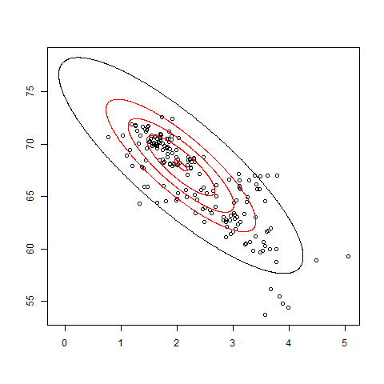

---
output:
  html_document: default
  pdf_document: default
---

```{r, include=FALSE}
require("ggplot2") 
require("gridExtra")
```

## 3 Průzkumová analýza dat {#EDA}

```{r diagram_img, fig.align='center', fig.cap="\\label{fig9} Posloupnost datové analýzy",out.width= '100%', fig.pos='H', echo=FALSE}
knitr::include_graphics("fig/EDA_diagram2.png")
```

\qquad Úkolem průzkumové analýzy dat (*Explanatory Data Analysis*, zkráceně EDA) je vizualizace a transformace dat systematickým způsobem za účelem maximálního pochopení dat, určení vztahu mezi nimi a posouzení jejích kvality. EDA je důležitou části datové analýzy a měla by být jedním z jejích prvních kroků.

\qquad Zařazení průzkumové analýzy dat do procesu datové analýzy je zobrazeno v diagramu \ref{fig9}. Prvním krokem datové analýzy je **import** dat. Obecně to v tomto případě znamená nahrání obdržených dat ze souboru či databáze do prostředí R. Bez tohoto kroku datová analýza nemůže být vykonána. V momentě když data jsou importována do R je vhodné je **očístit** neboli **přípravit**. Tím je myšleno ukládání dat v konzistentní a systematické formě, odpovídající sémantice původního datasetu. Zkrátka očištěná data jsou taková data, ve kterých sloupce odpovídají proměnným a řádky odpovídají pozorováním. Takováto příprava dat usnadňuje další práci s nimi. 

\qquad Jakmile jsou data očištěna, je obvyklým krokem jejich __transformace__. Transformací se rozumí omezení pozorování (například dle zájmového území či povodí), vytváření nových proměnných na základě již existujících, agregace (např. z denního do měsíčního kroku), výpočet souhrnných statistik (středních hodnot, kvantilů atd.), odstranění odlehlých pozorování a normalizace. Poté, co jsou data očištěná a obsahují veškeré potřebné proměnné, je možné na ně aplikovat dva nejdůležitější nástroje k zjištění informací: vizualizaci a modelování. Jakákoliv analýza tyto nástroje opakovaně využívá, ačkoliv samozřejmě mají své výhody a nevýhody. 

\qquad __Vizualizace__ je schopná odhalit neočekávané chování dat a napovědět další směr analýzy. Vizualizaci lze odhalit nevhodně zvolená či špatně připravená data a nekorektní dotazování. I přesto, že vizualizace je dobrým nástrojem datové analýzy, její aplikace na větší datasety je značně náročná a interpretace výsledků je subjektivní, tudíž závisí na analytikovi. 

\qquad __Modelování__ je v ramci průzkumové analýzy dat doplňkem vizualizace. Jedná se o zásadně matematický a výpočetní nástroj, který se obecně hodí i na větší datasety. Téměř každý model musí splňovat své předpoklady, které by měli být ověřeny před jejich aplikací, na rozdíl od vizualizace, která žádné předpoklady nevyžaduje.[@grolemund_wickham2017] 

\qquad Důležitou součástí analýzy je **interpretace** výsledků a formulace závěrů. Vyhodnocuje, jak dobře zvolený model či vizualizace slouží k pochopení dat a jejich popisu. Je také důležité si uvědomit komu jsou výsledky interpretovány, kdo je cílová skupina. Dobře provedené grafické výstupy podložené jejich správnou interpretaci jsou jedním z nejlepších způsobů prezentace dat. 

\qquad Průzkumová analýza dat není specifikována jako konkrétní soubor pravidel a postupů, ale jako přístup k analýze dat. Obvykle zahrnuje následující kroky:

* vyhledávání vybočujících (odlehlých) pozorování
* náhrada chybějících hodnot
* transformace dat
* změny typu proměnných
* ověřování normality

### 3.1 Odlehlá pozorování

\qquad Odlehlá pozorování (*outliers*) jsou významně odlišná vůči ostatním hodnotám datasetu. Definice toho, jak moc odlišná taková pozorování mají být je dáno analytikem na základě konkretního datasetu a kontextu problematiky. Tato pozorování mohou být indikátorem chybných dat nebo vzácných událostí. Důvody proč se tato pozorování vyskytují by měli být pečlivě zkoumány. Dále je důležité posoudit, jak je jimi výsledek analýzy ovlivněn, případně zdali je předpoklady metody připouštějí. 

\qquad Hledání odlehlých, vybočujících, pozorování a jiných anomálií pro jednotlivé veličiny lze provést graficky například pomoci boxplotu (viz. sekce [2.3.2](#boxplot)), bodových grafů ([2.1](#scatterplot)) nebo číslicových histogramů ([2.4.3](#stem-and-leaf)). Dají se také vypočítat pomocí různých statistik, například metodou *jackknife*, která je popsána v následující kapitole ([3.1.1](#jackknife)). V momentech, kdy je vizualizace obtížná (velké datasety, větší množství navzájem se ovlivňujících proměnných, atd.), využívají se nástroje vícerozměrné, například Mahalanobisovy vzdálenosti ([3.1.2](#mbdist)), *leverages* ([3.1.3](#leverages)) a další.
 
#### 3.1.1 *Jackknife* {#jackknife}

\qquad Metoda byla původně představená Johnem W. Tukey v roce 1958 v "*The Annals of Mathematical Statistic*" [@jackknife_tukey] a jedná se o speciální případ metody *bootstrap* (více o metodě B. Efron a R. Tibshirani v "*An Introduction to the Bootstrap*" [@bootstrap]).

\qquad Postup metody *jackknife* je založen na celkem jednoduché myšlence. Zjišťují se souhrnné statistiky podsouborů (*Jackknife Samples*), které se vytvářejí postupným vypouštěním jednotlivých pozorování z původního datasetu. Jinými slovy existuje $n$ unikátních Jackknife podsouborů a $i$-tý Jackknife podsoubor je definován jako vektor.

\qquad Pomocí porovnání souhrnných statistik původního datasetu a vytvořených Jackknife podsouborů se odhadne vliv jednotlivých pozorování na původní dataset. Jedná ze souhrnných statistik, kterou lze použít je střední hodnota $\bar{x}$. Pro původní dataset obsahující $n$ pozorování lze střední hodnotu odhadnout dle vzorce $\bar{x} = \frac{1}{n} \sum \limits_{i=1}^{n} \bar{x}_i$. Střední hodnota Jackknife podsouborů se vyhodnotí následovně: 
$$\bar{x}_i = \frac{1}{n-1} \sum \limits_{j=1, j \neq i}^{n} x_j, \quad \text{kde } i=1,\dots,n.$$ 
Porovnání lze provést dle vzorce $\textit{Var}(\bar{x}) = \frac{n-1}{n} \sum \limits_{i=1}^{n}(\bar{x}_i - \bar{x})^2$, kde $\textit{Var}(\bar{x})$ je odhad rozptylu, který indikuje, jak moc jednotlivá pozorování ovlivňují dataset, tj. přítomnost odlehlých pozorování. Metoda může být také použita k odhadu skutečné, neovlivněné střední hodnoty datasetu. [@mcintosh2016]

#### 3.1.2 Mahalanobisovy vzdálenosti {#mbdist}

\qquad K měření vzdálenosti mezi objekty se často používá euklidovská vzdálenost. Euklidovská vzdálenost je jednoduchá na výpočet a interpretaci, ale není schopná brát v úvahu vztahy mezi daty. Proto je v řádě případů vhodné použít mahalanobisovou vzdálenost. Je definovaná matice $\bm{X}(n \times p)$, obsahující $n$ objektů $\bm{x}_i$ a $p$ proměnných. Euklidovská vzdálenost mezi vektorem $i$-tého řádku $\bm{x}_i (1 \times p)$ této matice a vektoru středních hodnot $\bar{\bm{x}} (1 \times p)$ se spočítá jako
$$ED_i = \sqrt{(\bm{x}_i - \bar{\bm{x}})(\bm{x}_i - \bar{\bm{x}})^T}, \quad \text{pro } i = 1,\dots,n$$
zatímco mahalanobisova vzdálenost se spočítá jako
$$MD_i = \sqrt{(\bm{x}_i - \bar{\bm{x}}) \bm{C}^{-1}_x (\bm{x}_i - \bar{\bm{x}})^T}, \quad \text{pro } i = 1,\dots,n$$
kde $\bm{C}_x$ je kovarianční matice. [@mbdist2]

\qquad Na obrázku \ref{fig10} jsou znázorněny elipsy mahalanobisových vzdáleností, kde každá elipsa představuje vzdálenost od průměru. Z tohoto je zřejmé, že vzdálenost roste pomaleji ve směru korelace. Pozorování, které je výrazně vzdáleno od středu, ale leží ve směru závislosti, má nižší mahalanobisovou vzdálenost než pozorování, které je stejně vzdáleno od středu, ale neleží ve směru závislosti. Tato vlastnost mahalanobisových vzdálenosti umožňuje identifikaci odlehlých pozorování.

\qquad Metoda byla představena P.C. Mahalanobisem v roce 1936 ve článku *"On the Generalized Distance in Statistics"* [@mbdist]. Mahalanobisové vzdálenosti se používají nejenom k nalezení odlehlých pozorování, ale i ke zkoumání reprezentativity mezi dvěma data sety, aplikuje se v algoritmu $k$-nejbližších sousedů, v diskriminační analýze a má mnoho dalších uplatnění. 

```{r mbdist_img, fig.align='center', fig.cap="\\label{fig10} Mahalanobisovy vzdálenosti",out.width= '65%', fig.pos='H', echo=FALSE}

```

#### 3.1.3 Leverages {#leverages}

\qquad Leverage (případně též efekt, vliv nebo projekční $h$ prvek) se používá v regresní analýze k měření velikosti vlivu pozorování na regresní odhad. Princip metody spočívá v kontrole diagonálních prvků projekční matice $\bm{H}$, která je produktem metody nejmenších čtverců a je definována 
$$\bm{H} = \bm{X}(\bm{X}^T\bm{X})^{-1}\bm{X}^T.$$
Model lineární regrese může být zapsán následovně: 
$$\bm{y} = \bm{X \beta} + \bm{\varepsilon},$$
kde vektor vysvětlované proměnné je $\bm{y}$, matice vysvětlujících proměnných je $\bm{X}$, vektor regresních koeficientů, který je odhadován, je $\bm{\beta}$ a vektor náhodné složky je $\bm{\varepsilon}$. Metoda nejmenších čtverců poskytuje řešení regresních rovnic: 
$$\bm{\beta} = (\bm{X}^T\bm{X})^{-1} \bm{X}^T \bm{y}.$$
Lze dosadit: 
$$\hat{\bm{y}} = \bm{X \beta} = \bm{X}(\bm{X}^T\bm{X})^{-1} \bm{X}^T \bm{y}.$$
Výsledný vektor má tvar $\hat{\bm{y}} = \bm{Hy}$, kde $\bm{H}$ je projekční matice. [@leverages_regression]

### 3.2 Náhrada chybějících pozorování

\qquad Problém chybějících pozorování spočívá v neschopnosti jejich zpracovávání některými metodami. Takové hodnoty lze vynechat nebo doplnit (nahradit) jednou z řady metod. Vynechání hodnot vede k nežádoucímu zmenšení datasetu, proto je výhodnější chybějící údaje doplnit. Nejednodušším nástrojem pro náhradu chybějících hodnot je aritmetický průměr příslušné proměnné. Tento způsob může vést ke zkresleným odhadům (neplatí-li předpoklad, že chybějící údaje jsou zcela náhodné) a podhodnocuje variabilitu a kovarianci datasetu, a proto se nedoporučuje v případě vyššího podílu chybějících údajů. Další možnou metodou je náhrada náhodným číslem generovaným z příslušného rozdělení (parametry jsou odhaduty z výběru). V tomto případě se respektuje variabilita datasetu, ale nerespektuje se jeho kovariance. Chybějící údaje lze také odvodit pomocí známých hodnot na základě pomocné jednoduché lineární regresní funkce. Tato metoda respektuje nejenom variabilitu vzorku, ale i jeho korelační strukturu. [@pecakova]

### 3.3 Transformace dat

\qquad Jedním z cílů transformace dat je dosažení srovnatelnosti proměnných: sjednocení měřítka, variace a typu proměnných. Hlavním využitím je splnění podmínek vyžadovaných metodami, například podmínky normality, kde je snaha převést data na normální rozdělení, snížení vlivu rušivých proměnných (odlehlých hodnot) atd. [@transformation] Rozdělujeme transformaci lineární (centrování, normování) a nelineární (plynoucí z typu a charakteru dat).

\qquad Lineární transformace zachovává lineární vztahy mezi proměnnými. Jedním z příkladů takovéto úpravy dat je metoda centrování, která se používá u vícerozměrných analýz. Podstata metody spočívá v zachování měřítka vzorku při změně hodnot: od původních hodnot se odečítá průměr proměnné (od prvků sloupce se odečte jejich sloupcový průměr), průměry získaných nových proměnných se tudíž rovnají nule. Toto lze zapsat následovně: 
$$v_{ij} = x_{ij} - \bar{x}_j$$
Vektor průměrů $\bar{\bm{v}}$ je nulový, kovariance a korelace proměnných zůstává nezměněna. [@vicerozm_stat] Další často využívanou metodou je metoda normalizace dat. Tato metoda transformuje měřítka vzorků pro možnost jejich porovnání (eliminuje jednotky měření), po úpravě střední hodnota vzorku tedy odpovídá nule a odchylka jedničce (normální rozdělení).
$$z_{ij} = \frac{x_{ij} - \bar{x}_j}{\sigma(x_j)}$$
$\sigma(x_j)$ je směrodatná odchylka sloupce proměnné, vektor průměrů $\bar{\bm{z}}$ je nulový a kovariance vektoru nových proměnných se shoduje s korelací původního vektoru. [@normalizing]

\qquad Nelineární transformace vyplývá z typu dat a mění (snižuje či zvyšuje) lineární vztahy mezi proměnnými a to znamená, že nezachovává korelaci mezi nimi. Pokud data mají charakter absolutní četnosti, používá se odmocninová transformace $X^{\prime} = \sqrt{X}$, pokud odpovídají log-normálnímu rozdělení, používá se logaritmická transformace $X^{\prime} = \log_{10}X$ atd. Logaritmus náhodné veličiny s log-normálním rozdělením má normální rozdělení (viz obrázek \ref{fig11}). Logaritmická transformace může být použita pouze u nezáporných rozdělení. [@zumel_2014] [@kutner_transform]

```{r lognormal_to_normal, message=FALSE, warning = FALSE, echo=FALSE, out.width='82%', fig.align='center', fig.cap="\\label{fig11} Log-normální rozdělení transformováné na normální rozdělení", fig.pos='H'}
X <- rlnorm(1000, 0 ,1)
p1 <- ggplot() + #log-norm
  geom_histogram(aes(X), col = "black", fill = "white") +
  labs(title = "Log-normální rozdělení") +
  labs(x = "X", y = "Četnosti") +
  xlim(c(0,10))+
  theme_classic()
p2 <- ggplot() + #norm
  geom_histogram(aes(log(X)), col = "black", fill = "white") +
  labs(title = "Transformováné rozdělení") +
  labs(x = "X", y = "Četnosti")+
  theme_classic()
grid.arrange(p1, p2, ncol = 2)
```


### 3.4 Ověřování normality {#normtests}

\qquad Důležitým aspektem popisu proměnné je tvar jejího rozdělení, který udává četnosti hodnot z různých rozsahů proměnné.
Většina statistických testů a metod se zakládá na předpokladu, že proměnná má normální rozdělení. Z tohoto důvodu je vhodné ověřovat normalitu rozdělení analyzovaného vzorku.

\qquad Zjistit zda-li vzorek pochází z normálního rozdělení lze grafickým posouzením nebo pomocí testů normality. Mezi nástroje grafického posouzení normality se řadí histogram rozdělení četnosti (kapitola [2.4.1](#hist)), graf výběrové distribuční funkce ([2.3](#distribution)), Q-Q graf a P-P graf ([2.3.1](#qqpp)). Vztah hustoty rozdělení a Q-Q grafu je znázorněn na obrázku \ref{fig12}. Dále existuje řada testů normality, zde jsou popsany testy Shapiro-Wilk (SW) a Jarqua-Bera (JB). 

```{r density_qq_plot, echo=FALSE, out.width='95%', fig.align='center', fig.cap="\\label{fig12} Vztah hustoty rozdělení a Q-Q grafu pro různá narušení normality", fig.pos='H'}
x1 <-  rlnorm(45,0,.6)
x2 <-  -rlnorm(45,0,.6)
x3 <- runif(300,-2,2)
x4 <- smoothmest::rdoublex(300,0,1)

par(mfrow=c(2,4))

plot(density(x1), main="Záporné zešikmení")
abline(v=mean(x1), col="red")
plot(density(x2), main="Kladné zešikmení")
abline(v=mean(x2), col="red")
plot(density(x3), main="Nižší špičatost")
abline(v=mean(x3), col="red")
plot(density(x4), main="Vyšší špičatost")
abline(v=mean(x4), col="red")

qqnorm(x1)
qqline(x1)
qqnorm(x2)
qqline(x2)
qqnorm(x3)
qqline(x3)
qqnorm(x4)
qqline(x4)
```

\qquad Shapiro-Wilk test byl poprvé představen v roce 1965 S. S. Shapirem a M. Wilkem [@SW_test]. Metoda dokáže pracovat se vzorky velikosti 12 až 5000 pozorování. Nulová hypotéza tohoto testu předpokládá, že vzorek má normální rozdělení. Pokud $p$-hodnota je menší, než zvolená hladina významnosti, zamítá se nulová hypotéza, jinými slovy vzorek nemá normální rozdělení. Statistika testu vypadá následovně:
$$W = \frac{\big(\sum \limits^n_{i=1} a_i x_{(i)}\big)^2}{\sum \limits^n_{i=1}(x_i - \bar{x})^2},$$
kde $x_{(i)}$ je $i$-tý nejmenší prvek (statistika $i$-tého řádu), $\bar{x}$ je průměr vzorku, $n$ je počet pozorování.

\qquad Jarqua-Bera test závisí na koeficientech šikmosti a špičatosti. Statistika JB testu může být zapsána:
$$T = n \bigg( \frac{(\sqrt{b_1})^2}{6} + \frac{(b_2 - 3)^2}{24} \bigg),$$
kde $n$ je velikost vzorku, $\sqrt{b_1}$ je koeficient šikmosti vzorku a $b_2$ je koeficient špičatosti. Nulová a alternativní hypotéza se schoduje s SW testem. Používá se pro větší datasety nad 2000 pozorování. [@normality_tests]
 
# Praktická část {-}

## 4 Praktická vizualizace dat

### 4.1 Prostředí R

#### 4.1.1 Balíčky

#### 4.1.2 ...

### 4.2 Balíčky pro vizualizaci dat

#### 4.2.1 ggplot2

#### 4.2.2 lattice

#### 4.2.3 rgl

### 4.3 Balíčky pro interaktivní vizualizaci dat (htmlwidgets)

#### 4.3.1 plotly

#### 4.3.2 dygraphs

#### 4.3.3 leaflet

#### 4.3.4 ggvis

### 4.4 Balíčky pro prostorová data

#### 4.4.1 ggmap

### 4.5 ...

#### 4.5.1 raster

#### 4.5.2 rasterVis

### 4.6 Balíčky pro webové aplikace

#### 4.6.1 shiny

#### 4.6.2 flexdashboard

#### 4.6.3 dashboard
